# SMD Assignment 1 - Attendance Hub

A mobile-first React Native (Expo) app that reimagines the **attendance part of the FLEX student portal**.

## The problem

On FLEX, attendance is a table of numbers. A student can see "72%" but not what it *means*: how many classes can still be skipped, how many must be attended in a row to recover, or which course is in trouble first. Students usually only find out after they fall below the minimum.

## The solution

Attendance Hub turns attendance records into **actionable guidance**:

- Every course is classified as **Safe**, **Borderline** or **Below limit** against a configurable threshold (75%).
- Each course shows a plain-language recommendation, for example *"Attend the next 3 classes in a row to reach 75%"* or *"You can miss 2 more classes"*.
- A dashboard gives an at-a-glance summary with charts.
- Students can record a class as present or absent and see everything update immediately.

## Features

| Area | What it does |
| --- | --- |
| Dashboard | Overall attendance, status counts, and three `react-native-chart-kit` charts: **Bar** (attendance per course), **Pie** (courses by status), **Line** (weekly trend) |
| My Courses | Live **search**, **filter** (All / Below 75% / Safe) and **sort** (lowest, highest, A-Z) |
| Course detail | Percentage, animated progress bar, "can miss / must attend" calculation, Present/Absent buttons, recent-class log, remove course |
| Alerts | Prioritised recommendations built from the data (critical first) |
| Add Course | Form with validation (`keyboardType`, `maxLength`, `autoCapitalize`, inline errors, duplicate check, attended <= held) |
| States | Empty list, no search results, no alerts, no courses, invalid input, course not found |

## Meeting the assignment requirements

- **No navigation library, no side/bottom bars.** Views are switched with a single `view` state in `App.js` (`dashboard`, `courses`, `detail`, `addCourse`, `alerts`), with Back buttons.
- **Data-driven UI.** All lists and charts are generated from the `courses` array in `src/data/mockData.js`.
- **Derived state.** `App.js` stores raw `attended`/`held` and computes percentage, status, and recommendations with `withStats()`, so changing any value updates the whole UI.
- **Reusable components.** `Card`, `AppButton`, `StatTile`, `StatusBadge`, `ProgressBar`, `CourseCard`, `FilterChips`, `FormField`, `EmptyState`, `ScreenHeader`.
- **Live-change friendly.** The threshold is one constant: `ATTENDANCE_THRESHOLD` in `src/data/mockData.js`.

## Project structure

```
App.js                      state + view switching
src/
  theme.js                  colours, status labels
  data/mockData.js          sample student, courses, threshold, trend
  utils/attendance.js       percentage, status, can-miss/needed, alerts, validation
  components/               reusable UI pieces
  screens/                  Dashboard, Courses, CourseDetail, AddCourse, Alerts
screenshots/                app screenshots
```

## Setup and run

Requirements: Node.js 20+ and npm. For a phone, install **Expo Go**.

```bash
npm install
npx expo start
```

- Scan the QR code with Expo Go (Android) or the Camera app (iOS), or
- press `a` for an Android emulator, or
- run `npx expo start --web` to open it in a browser (use a phone-sized window).

## Screenshots

| Dashboard | Charts | Trend |
| --- | --- | --- |
| 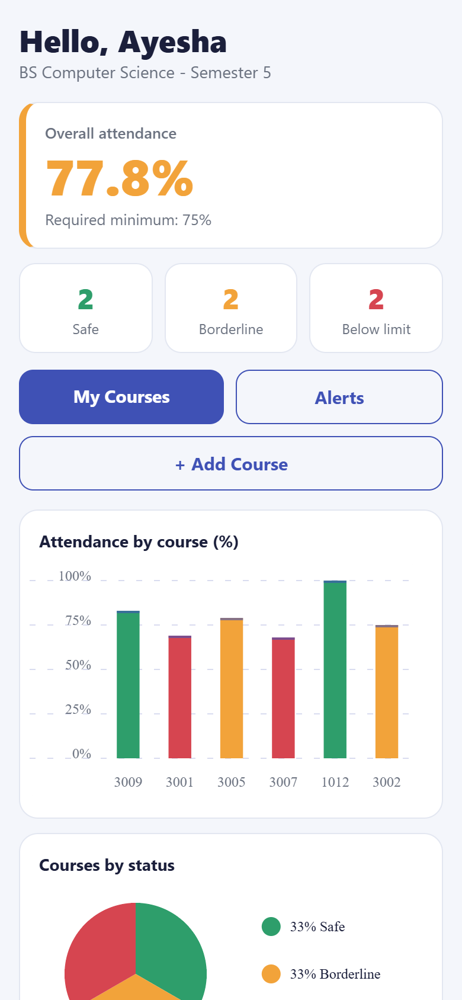 |  | 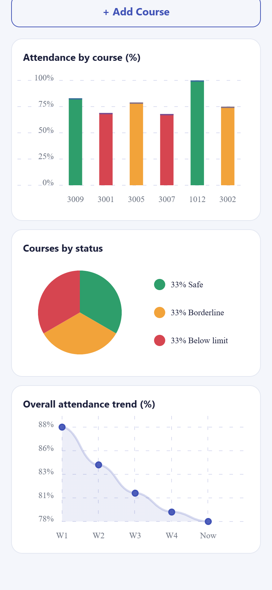 |

| Courses | Filtered (below 75%) | Empty search |
| --- | --- | --- |
| 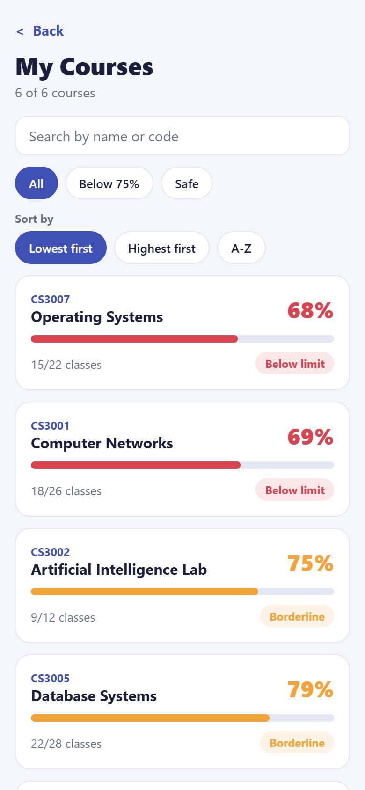 | 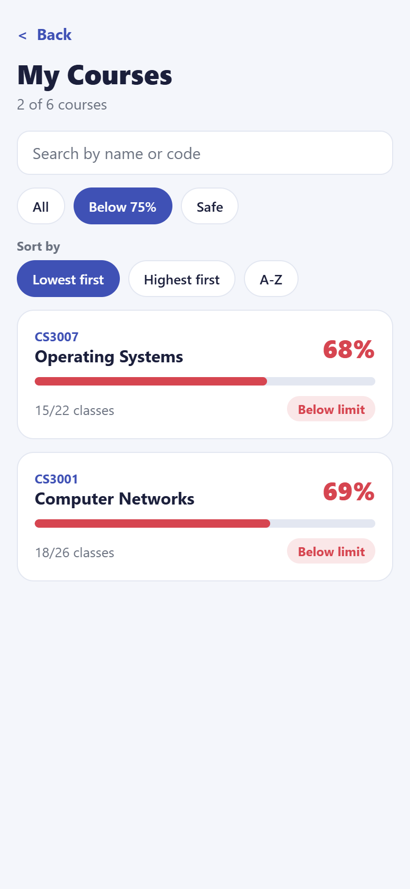 | 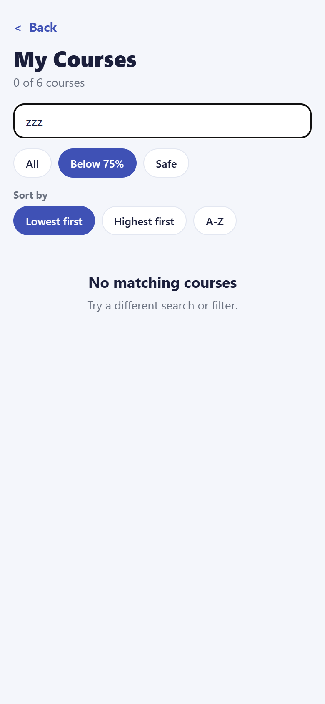 |

| Course detail | After marking 3 present | Alerts |
| --- | --- | --- |
| 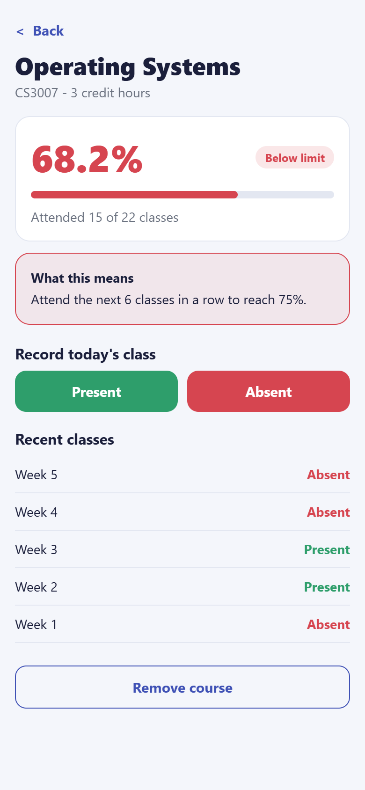 | 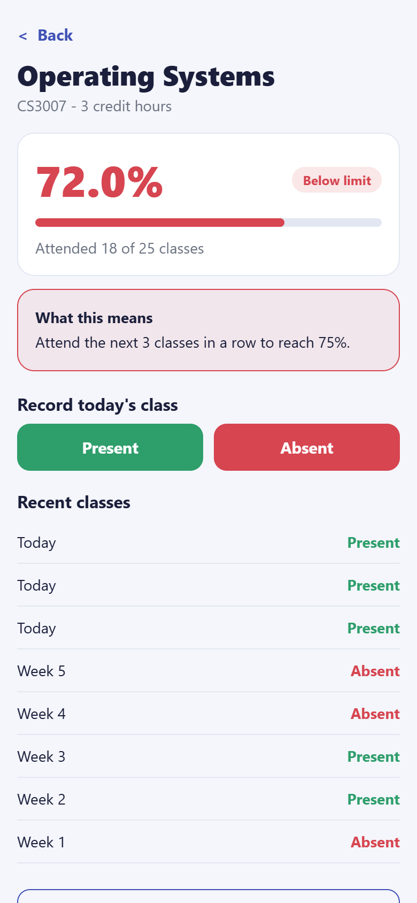 | 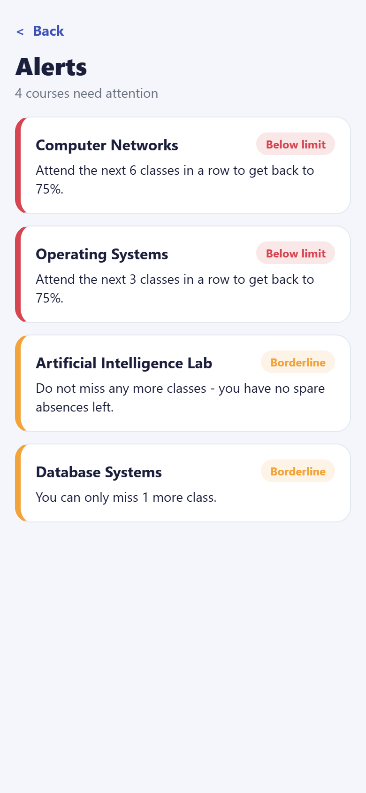 |

| Form validation | Valid form | Course added |
| --- | --- | --- |
| 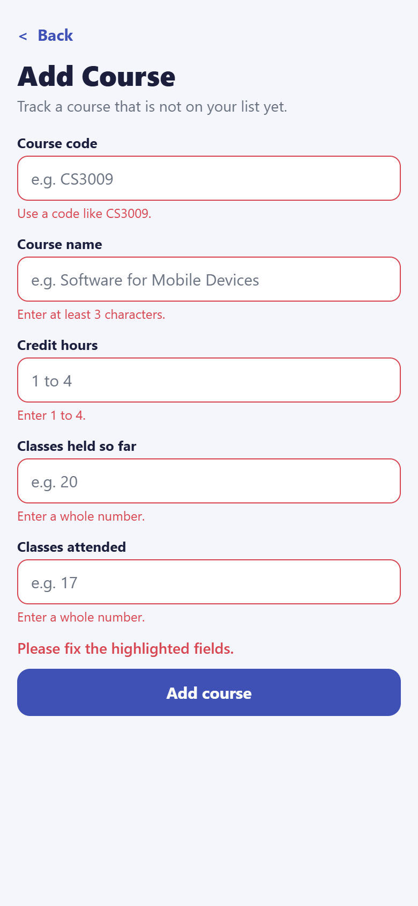 | 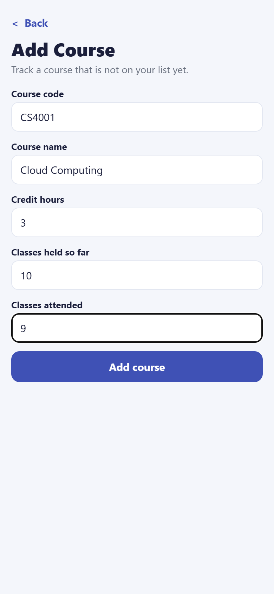 | 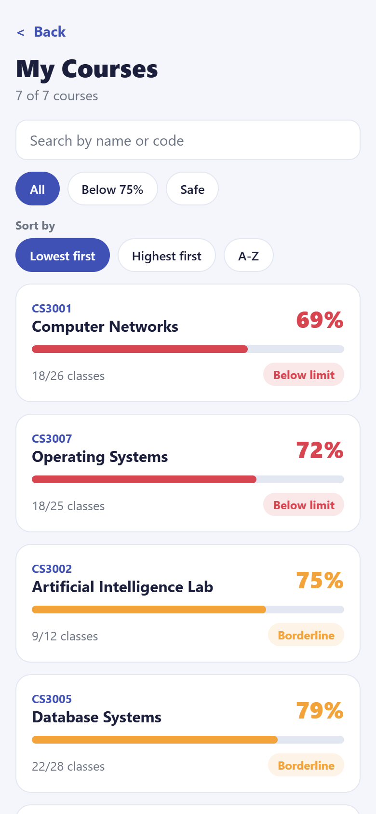 |

## Notes

- All data is **sample data**; no real student records are used.
- Data is held in memory, so it resets when the app reloads.
- The screenshots were captured from the web build at a 390x844 viewport. On web, `react-native-chart-kit` logs harmless console warnings about SVG props; they do not occur on devices.
- AI usage is documented in [AI Usage Report.docx](AI%20Usage%20Report.docx).
